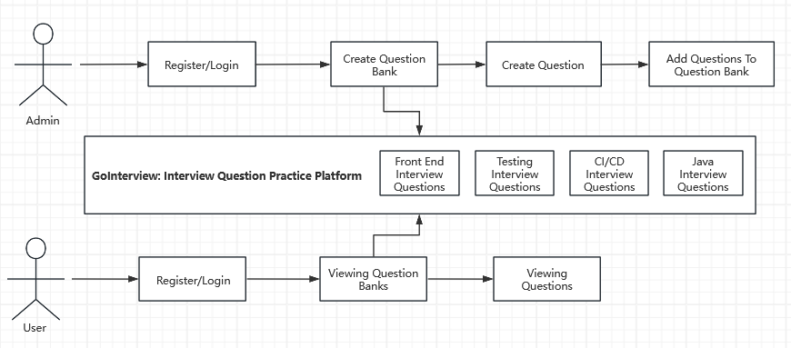
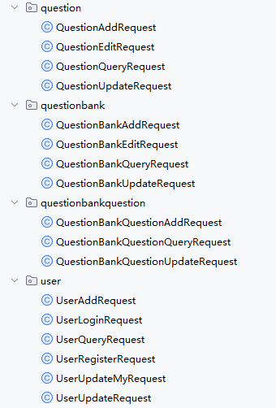

## Project GoInterview

In this project, we will build a platform for interview question practice.

> Administrators can create question banks, questions, and solutions, and batch associate questions with question banks. Users can register and log in, search questions using keyword segmentation, practice questions online, and view their practice history via a calendar.

The project involves the implementation and explanation of many enterprise-level technologies, such as using **database connection pools**, **hot key detection**, **caching**, and **advanced data structures** to improve system performance. It also enhances system and content security through **traffic control**, **circuit breaking**, **dynamic IP blacklist/whitelist filtering**, **same-session login conflict detection**, and **tiered anti-scraping** strategies.
### Project modules overview

#### Basic Modules(P0 level)

1. User Module
   1. login and register
   2. (Admin)User management-CRUD
2. Question Module
   1. Question searching
   2. Question viewing
   3. (Admin)Question management-CRUD
3. Question Bank Module
   1. Question bank viewing
   2. Viewing questions in a question bank
   3. (Admin)Question bank management-CRUD

#### Advanced Modules(P1-P2 level)

1. Question Batch Management **P1**
   1. Admin: Add batches of questions into question bank
   2. Admin: Remove batches of questions from a question bank
   3. Admin: Delete batches of questions from a bank 
2. Segmented Keyword Question Search **P1**
3. Calendar of user's practice records **P1**
4. Automatic Caching of Hot Questions **P2**
5. Traffic Control and Circuit Breaking **P2**
6. Dynamic IP blacklist and whitelist filtering **P2**
7. Same-end login conflict detection **P2**
8. Graded questions anti-crawler strategy **P2**

### Core business process



### Database design

#### Entities
In this system, we will have different entities, **user, question_bank, question**.

#### Relationship
1. user can create questions and question banks, but each question has only one creator, so does the question bank. **So the relationship between user and question is 1 to N, and the relationship between user and question bank is also 1 to N**
2. each question can be categorized into different question banks. each question bank can have multiple questions. **So the relationship between question and question bank is many-to-many**

#### Create tables

> Entity tables

- User table
```sql
create table if not exists user
(
	id 				bigint auto_increment comment 'id' 			primary key,
    userAccount 	varchar(256) 								not null comment 'account',
    userPassword 	varchar(256) 								not null comment 'password',
    subId 			varchar(256) 								null comment 'third party login id',
    userName 		varchar(256) 								null comment 'name',
    userAvatar 		varchar(256) 								null comment 'avatar',
    userProfile 	varchar(512) 								null comment 'profile',
    userRole 		varchar(256) default 'user' 				not null comment 'user role: user/admin',
    editTime 		datetime default CURRENT_TIMESTAMP 			not null comment 'last edited time',
    createTime 		datetime default CURRENT_TIMESTAMP 			not null comment 'created time',
    updateTime 		datetime default CURRENT_TIMESTAMP 			not null on update CURRENT_TIMESTAMP comment 'last updated time',
    isDelete 		tinyint default 0 							not null comment 'logical delete',
    index idx_subId (subId)
) comment 'user' collate = utf8mb4_unicode_ci;
```
the PK is `id`, `userAvatar` is the url of profile picture.

`createTime`, `editTime`, `updateTime`, and `isDelete` are the basic four fields for a database table.

Here we create an index for `subId`, because the `subId` is often used for searching a certain user. Nowadays, most people will use google mail for third-party login. 

- Question bank table
```sql
create table if not exists question_bank
(
	id 			bigint auto_increment comment 'id' 	primary key,
    title 		varchar(256) 						null comment 'question title',
    description text 								null comment 'question description',
    picture 	varchar(2048) 						null comment 'question picture',
    userId 		bigint 								not null comment 'the creator id',
	editTime 	datetime default CURRENT_TIMESTAMP 	not null comment 'last edited time',
    createTime 	datetime default CURRENT_TIMESTAMP 	not null comment 'created time',
    updateTime 	datetime default CURRENT_TIMESTAMP 	not null on update CURRENT_TIMESTAMP comment 'last updated time',
    isDelete 	tinyint default 0 					not null comment 'logical delete',
    index idx_title(title)
) comment 'question bank' collate = utf8mb4_unicode_ci;
```
The field `picture` will store the picture url instead of the image file. The foreign key is `userId`, referring to the `id` field in user table.

As many searches in real use case are based on the title of the question, we will create an index based on the question title.

> Relationship tables

- Question and question bank table

```sql
create table if not exists question_question_bank
(
	id bigint auto_increment comment 'id' primary key,
    questionBankId bigint not null comment 'question bank id',
    questionId bigint not null comment 'question id',
    userId bigint not null comment 'creator id',
    createTime 	datetime default CURRENT_TIMESTAMP 	not null comment 'created time',
    updateTime 	datetime default CURRENT_TIMESTAMP 	not null on update CURRENT_TIMESTAMP comment 'last updated time',
    UNIQUE (questionBankId, questionId)
) comment 'question and question bank relationship' collate = utf8mb4_unicode_ci;
```

### Backend development

#### Models

> Entity Classes

We have three entities
1. user
2. question
3. question bank

And one relationship
1. question bank question

Based on the database tables, the entity classes should contain the desired data fields.

1. User
```java
/**
 * user
 * @TableName user
 */
@TableName(value ="user")
@Data
public class User implements Serializable {
    /**
     * id
     */
    @TableId(type = IdType.ASSIGN_ID)
    private Long id;

    /**
     * account
     */
    private String userAccount;

    /**
     * password
     */
    private String userPassword;

    /**
     * third party login id
     */
    private String subId;

    /**
     * name
     */
    private String userName;

    /**
     * avatar
     */
    private String userAvatar;

    /**
     * profile
     */
    private String userProfile;

    /**
     * user role: user/admin
     */
    private String userRole;

    /**
     * last edited time
     */
    private Date editTime;

    /**
     * created time
     */
    private Date createTime;

    /**
     * last updated time
     */
    private Date updateTime;

    @TableLogic
    private Integer isDelete;

    @TableField(exist = false)
    private static final long serialVersionUID = 1L;
}
```
2. Question
```java
/**
 * question
 * @TableName question
 */
@TableName(value ="question")
@Data
public class Question implements Serializable {
    /**
     * id
     */
    @TableId(type = IdType.ASSIGN_ID)
    private Long id;

    /**
     * question title
     */
    private String title;

    /**
     * question content
     */
    private String content;

    /**
     * tag list(JSON Array)
     */
    private String tags;

    /**
     * answer to question
     */
    private String answer;

    /**
     * the creator id
     */
    private Long userId;

    /**
     * last edited time
     */
    private Date editTime;

    /**
     * created time
     */
    private Date createTime;

    /**
     * last updated time
     */
    private Date updateTime;

    /**
     * logical delete
     */
    @TableLogic
    private Integer isDelete;

    @TableField(exist = false)
    private static final long serialVersionUID = 1L;
}
```
3. QuestionBank
```java
/**
 * question bank
 * @TableName question_bank
 */
@TableName(value ="question_bank")
@Data
public class QuestionBank implements Serializable {
    /**
     * id
     */
    @TableId(type = IdType.ASSIGN_ID)
    private Long id;

    /**
     * question bank title
     */
    private String title;

    /**
     * question bank description
     */
    private String description;

    /**
     * question bank picture
     */
    private String picture;

    /**
     * the creator id
     */
    private Long userId;

    /**
     * last edited time
     */
    private Date editTime;

    /**
     * created time
     */
    private Date createTime;

    /**
     * last updated time
     */
    private Date updateTime;

    /**
     * logical delete
     */
    @TableLogic
    private Integer isDelete;

    @TableField(exist = false)
    private static final long serialVersionUID = 1L;
}
```
4. QuestionBankQuestion
```java
/**
 * question and question bank relationship
 * @TableName question_question_bank
 */
@TableName(value ="question_question_bank")
@Data
public class QuestionBankQuestion implements Serializable {
    /**
     * id
     */
    @TableId(type = IdType.AUTO)
    private Long id;

    /**
     * question bank id
     */
    private Long questionBankId;

    /**
     * question id
     */
    private Long questionId;

    /**
     * creator id
     */
    private Long userId;

    /**
     * created time
     */
    private Date createTime;

    /**
     * last updated time
     */
    private Date updateTime;

    @TableField(exist = false)
    private static final long serialVersionUID = 1L;
}
```

> DTO Data Transfer Object Classes

For each table, we should define the related `CRUD` request classes
1. User
2. Question
3. QuestionBank
4. QuestionBankQuestion



**Note**
1. Edit and updata request are different, the `update API` is designed for `Administrator`, able to access more data fields, while `edit API` is designed for `users`.
2. For `QuestionBankQuestion` table, the `edit request` is not really needed, so we omit the edit request

> VO View Object Classes

For the purpose of data masking, we need to define view object classes for each class. With a view object class, we can achieve the information masking, so that some sensitive message will not be sent to frontend side.

We can also implement two methods for converting the view object to entity class object:
1. objToVo
2. voToObj

#### Controller
